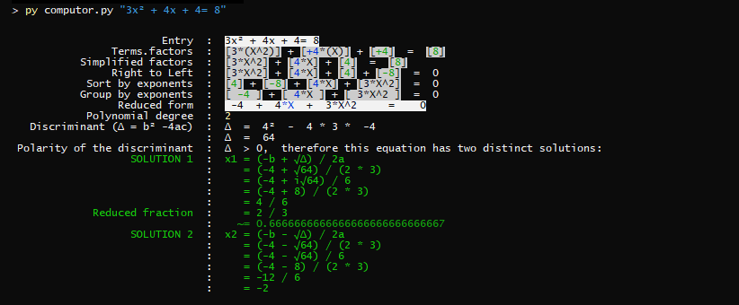

# ComputorV1 - 42 School Project

<a href="https://www.python.org" target="_blank" rel="noreferrer"></a>

## Introduction

ComputorV1 is a project from the Advanced Algorithms branch at 42 School, focused on solving polynomial equations of degree 2 in Python.

## Status:

Validated on 19/11/2024

Grade: 125% ✅

## Subject

Write a program that solves a polynomial **second or lower degree** equation.

You will have to show at least:

- The equation in its reduced form.
- The degree of the equation.
- It’s solution(s) and the polarity of the discriminant if it makes sens.

Bonus Features:

- Manage entry mistakes (vocabulary and syntax).
- Manage free form entrie.
- Display solution(s) as an irreducible fraction if it’s interesting.
- Display the intermediate steps.
- Handle input that does not respect the form: `a ∗ x^p`
- Handle exponents that are not properly organized or are missing.



## Installation

```bash
git clone https://github.com/fleuryD/42-computor-v1.git
cd 42-computor-v1
```

## Run one of the following commands:

```bash
py computor.py "5*X + 4*x^1 - 9.3 * X^2 = 1 * X^0"
py computor.py "3x² + 4x + 4= 8"
py computor.py "0x + 5 = 5"

py computor.py auto
```

- use `py` or `python3` depending on your system.
- use `auto` to run all the tests.

## How to solve a polynomial equation of degree 2:

### ax² + bx + c = 0

Where: a, b, and c are real numbers and `a ≠ 0`

### Calculating the discriminan:

```
Δ = b² - 4ac
```

- Si Δ = 0, then this equation has a unique solution:

```
x = -b / 2a
```

- Si Δ > 0, then this equation has two distinct solutions:

```
x1 = (-b - √Δ) / 2a
x2 = (-b + √Δ) / 2a
```

- Si Δ < 0, then this equation has no real solutions but two complex conjugate solutions:

```
x1 = (-b - √-Δ) / 2a
x2 = (-b + √-Δ) / 2a
``
```
